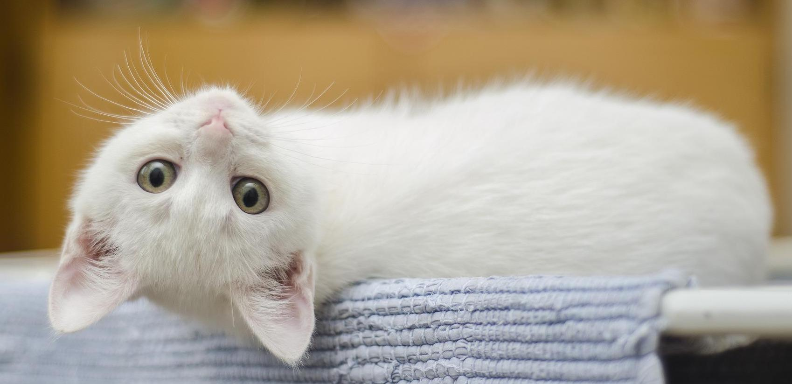

# Cat Token

ERC-20 token created as part of studying Solidity, Remix IDE, OpenZeppelin, and the Ethereum Ropsten testnet.

Contract deployed to Ethereum ropsten testnet at address  `0xFDDBb8c914930F3ccEC3205fc821d1932b6F4f89` with parameters `Cat Token` and `CAT`.

### Credit
- Completed as part of Web3 learning within LearnWeb3 Dao at https://www.learnweb3.io/